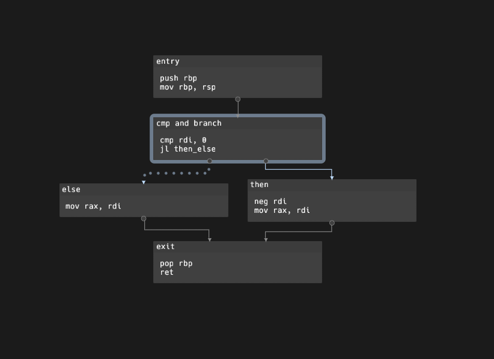
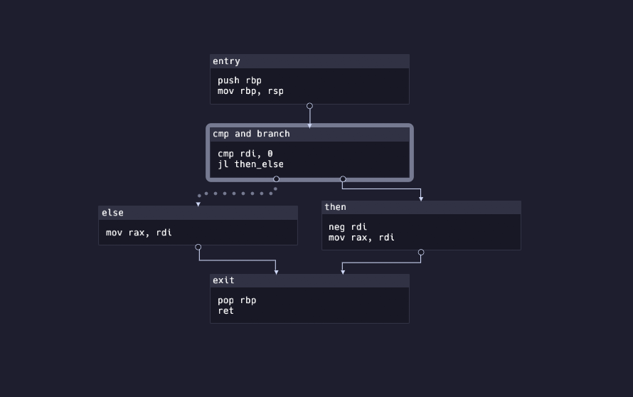

# egui-cfg
egui library for displaying control flow graphs using petgraph.

| Default | Custom |
|---|---|
|  |  |

## Usage
See the [examples](examples/) folder.

```toml
[dependencies]
egui-cfg = "*"
```

## Demo
```bash
$ git clone https://github.com/teabound/egui-cfg 
$ cd egui-cfg
$ cargo run --example basic --release
```
